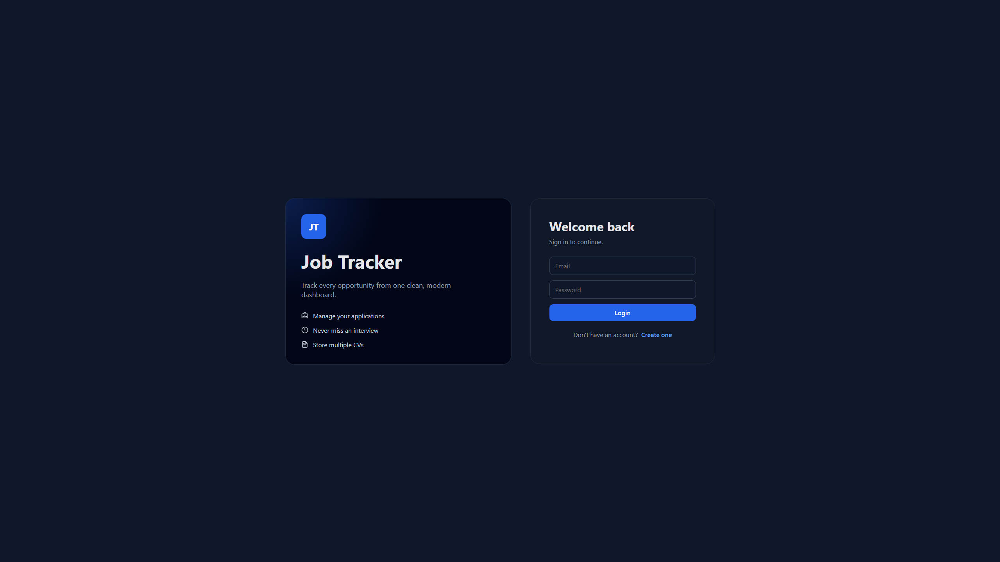
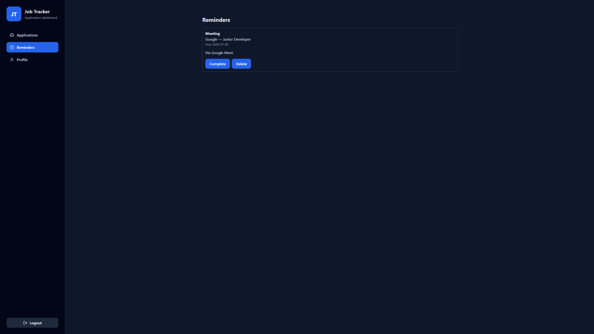
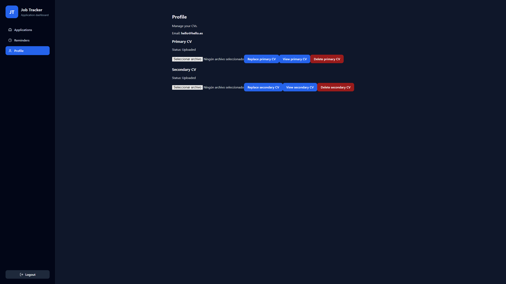

# Job Tracker

A modern fullstack web application to manage job applications, built with React, FastAPI, PostgreSQL and Docker.


---

## 📸 Preview








---

## 🚀 Live Demo

**Frontend**

```text
https://job-tracker-fullstack-three.vercel.app
```

**Backend API**

```text
https://job-tracker-fullstack-z6cy.onrender.com
```

**Swagger Documentation**

```text
https://job-tracker-fullstack-z6cy.onrender.com/docs
```

---

## ✨ Features

- Create, edit and delete job applications
- JWT Authentication
- Upload and manage CVs
- PostgreSQL database
- SQLAlchemy ORM
- Filter applications by status
- Search by company or position
- Sort by date, company or status
- Dashboard statistics
- Responsive interface
- Status badges
- Form validation
- Persistent frontend preferences with localStorage
- Automatic API documentation with Swagger

---

## 📚 What I Learned

During this project I practiced:

- Building a fullstack application with React and FastAPI
- Designing and consuming REST APIs
- Using SQLAlchemy ORM with PostgreSQL
- Implementing JWT authentication
- Managing file uploads with Supabase Storage
- Structuring scalable frontend and backend architectures
- Managing environment variables
- Containerizing applications with Docker
- Orchestrating multiple services using Docker Compose
- Deploying a fullstack application to Vercel and Render
- Creating responsive user interfaces
- Improving user experience with filtering, searching and validation

---

## 🚀 Project Evolution

### Initial Version

- SQLite database
- Basic CRUD operations
- React frontend connected to FastAPI

### Current Version

- PostgreSQL migration
- SQLAlchemy ORM
- JWT authentication
- CV upload with Supabase Storage
- Dockerized frontend, backend and database
- Docker Compose
- Cloud deployment on Render and Vercel

---

# ⚙️ Running Locally

## 1. Clone the repository

```bash
git clone https://github.com/ferggz/job-tracker-fullstack.git

cd job-tracker-fullstack
```

---

## 2. Backend

Create a virtual environment:

```bash
python -m venv .venv
```

Activate it:

**Windows PowerShell**

```powershell
.\.venv\Scripts\Activate.ps1
```

**Linux/macOS**

```bash
source .venv/bin/activate
```

Install dependencies:

```bash
pip install -r requirements.txt
```

Create a `.env` file inside `backend/`:

```env
DATABASE_URL=your_postgresql_database_url

SECRET_KEY=your_secret_key

SUPABASE_URL=your_supabase_url

SUPABASE_KEY=your_supabase_key
```

Run:

```bash
uvicorn main:app --reload
```

Backend:

```text
http://127.0.0.1:8000
```

Swagger:

```text
http://127.0.0.1:8000/docs
```

---

## 3. Frontend

Install dependencies:

```bash
npm install
```

Run:

```bash
npm run dev
```

Frontend:

```text
http://localhost:5173
```

---

# 🐳 Docker

Copy the example environment file.

**Windows**

```powershell
Copy-Item backend/.env.example backend/.env
```

**Linux/macOS**

```bash
cp backend/.env.example backend/.env
```

Start all services:

```bash
docker compose up --build
```

Stop services:

```bash
docker compose down
```

Available services:

| Service | URL |
|---------|------|
| Frontend | http://localhost:5173 |
| Backend | http://localhost:8000 |
| Swagger | http://localhost:8000/docs |

> PostgreSQL is exposed locally on port **5433** to avoid conflicts with existing PostgreSQL installations.