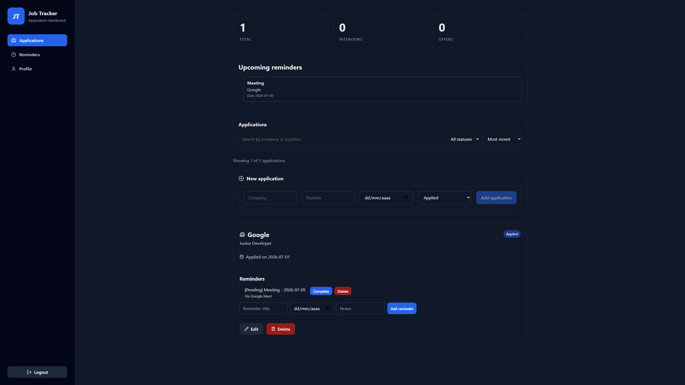
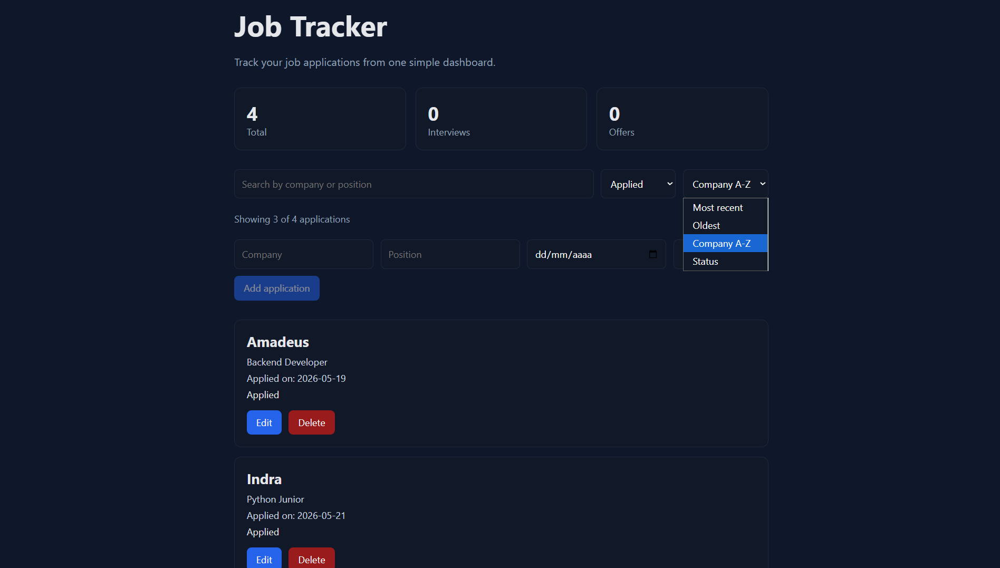
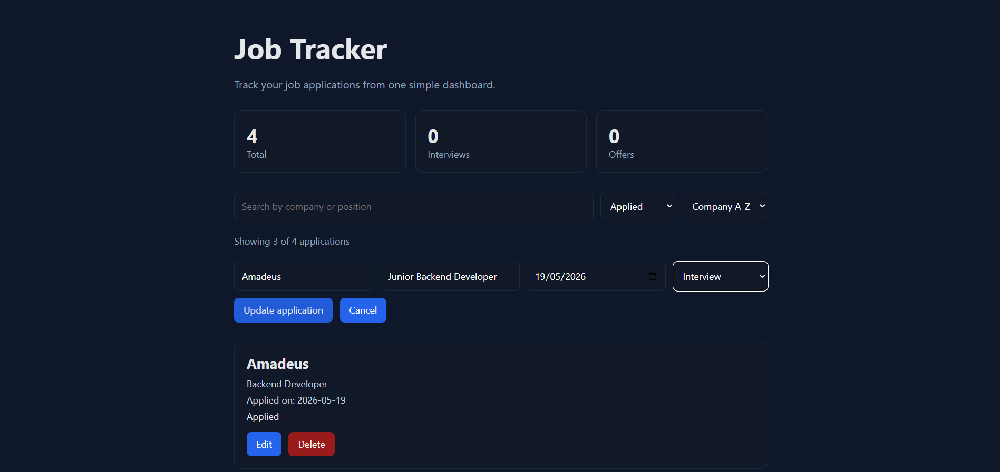

# Job Tracker Fullstack

A fullstack job application tracker built with React, FastAPI and SQLite.

The application allows users to create, manage, filter and organize job applications through a modern frontend connected to a REST API backend.

## Live Demo

Frontend:
```text
https://job-tracker-fullstack-three.vercel.app
```

Backend API:
```text
https://job-tracker-fullstack-z6cy.onrender.com
```

Swagger Documentation:
```text
https://job-tracker-fullstack-z6cy.onrender.com/docs
```

## What I Learned

Through this project I practiced:

- Building a fullstack application with React and FastAPI
- Connecting a React frontend to a REST API
- Using fetch and asynchronous API calls
- Structuring a React application using reusable components
- Managing state with React hooks
- Creating CRUD operations between frontend and backend
- Using SQLite for persistent data storage
- Building and consuming REST API endpoints
- Using Pydantic models for request validation
- Working with CORS middleware
- Organizing frontend services for API communication
- Creating responsive user interfaces with CSS
- Implementing filtering, sorting and search functionality
- Using localStorage to persist frontend preferences
- Improving frontend UX with conditional rendering and validations
- Structuring a fullstack project architecture

## Features

- Create, edit and delete job applications
- SQLite database persistence
- React frontend connected to FastAPI backend
- Filter applications by status
- Search applications by company or position
- Sort applications by date, status or company
- Dashboard statistics
- Responsive UI
- Status badges with different colors
- Form validation
- Local storage preferences
- Automatic FastAPI Swagger documentation

## Technologies Used

### Frontend

- React
- JavaScript
- CSS
- Vite

### Backend

- Python
- FastAPI
- SQLite
- Pydantic
- Uvicorn

## Project Structure

```text
job-tracker-fullstack/
│
├── backend/
│   ├── database.py
│   ├── init_db.py
│   ├── main.py
│   ├── requirements.txt
│   └── job_tracker.db
│
├── frontend/
│   ├── src/
│   │   ├── components/
│   │   ├── services/
│   │   ├── App.jsx
│   │   └── App.css
│   ├── package.json
│   └── vite.config.js
│
└── .gitignore
```

## How to Run

### Backend

Create and activate a virtual environment:

```bash
python -m venv .venv
source .venv/Scripts/activate
```

Install dependencies:

```bash
pip install -r requirements.txt
```

Initialize the database:

```bash
python init_db.py
```

Run the backend server:

```bash
uvicorn main:app --reload
```

Backend URL:

```text
http://127.0.0.1:8000
```

Swagger documentation:

```text
http://127.0.0.1:8000/docs
```

### Frontend

Install dependencies:

```bash
npm install
```

Run the frontend server:

```bash
npm run dev
```

Frontend URL:

```text
http://localhost:5173
```

## API Endpoints

### Get all applications

```text
GET /applications
```

### Create application

```text
POST /applications
```

Example body:

```json
{
  "company": "Google",
  "position": "Backend Developer",
  "status": "Applied",
  "date_applied": "2026-05-21"
}
```

### Update application

```text
PUT /applications/{id}
```

### Delete application

```text
DELETE /applications/{id}
```

## Screenshots

### Dashboard



### Filters and Search



### Edit Application

